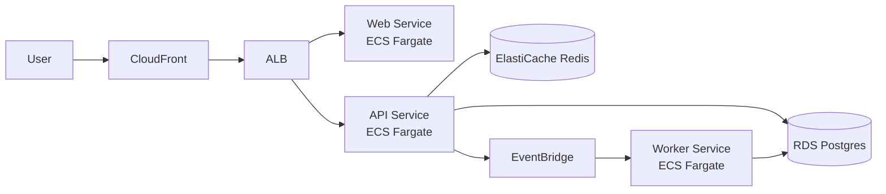

# Editable AI-Generated Architecture Diagrams

Create editable, source-controlled, maintainable software architecture diagrams from AI prompts.

This repository standardizes diagrams-as-code workflows so AI-generated diagrams stay easy to review, version, and update over time.

Supported outputs and use cases:

- Mermaid diagrams for architecture documentation, C4 diagrams, workflows, sequence diagrams, and data models
- draw.io diagrams for canvas-heavy layouts and polished architecture visuals
- AI-assisted architecture documentation that stays aligned with real systems
- source-controlled diagrams for long-term maintainability

## Works With

This repository includes compatibility adapters for:

- Claude Code
- OpenAI Codex
- GitHub Copilot
- Cursor
- VS Code AI workflows

Included adapter surfaces:

- [CLAUDE.md](CLAUDE.md)
- [.github/copilot-instructions.md](.github/copilot-instructions.md)
- [.cursor/rules/diagrams.mdc](.cursor/rules/diagrams.mdc)
- [adapters/codex.md](adapters/codex.md)

## Prompt to Output Example

### Example Prompt

"Generate a Mermaid C4-style container diagram for an AWS SaaS platform with CloudFront, ALB, ECS Fargate services, RDS, Redis, and EventBridge. Keep labels concise and editable."

### Generated Mermaid Output

Rendered result is directly viewable in GitHub Markdown with Mermaid support, and the source remains fully editable.

## Why This Exists

AI-generated diagrams are often hard to maintain because they are image-only, inconsistent, or disconnected from source control.

This repository solves that by providing reusable conventions for:

- editable diagrams instead of raster-only output
- maintainable architecture documentation workflows
- Mermaid and draw.io standards for AI-generated diagrams
- source-friendly artifacts that are easy to diff and review

## Quick Start

### Claude Code

Use this repository as diagram conventions context. Read [AGENTS.md](AGENTS.md) and [SKILL.md](SKILL.md), then generate or edit Mermaid or draw.io architecture diagrams.

Expected output: editable diagram source plus concise architecture documentation.

### Cursor

Use [.cursor/rules/diagrams.mdc](.cursor/rules/diagrams.mdc) as the compatibility entrypoint, then apply canonical guidance from [AGENTS.md](AGENTS.md).

Expected output: maintainable Mermaid or draw.io files that remain source-control friendly.

### GitHub Copilot Chat

Reference [.github/copilot-instructions.md](.github/copilot-instructions.md), then follow [AGENTS.md](AGENTS.md) and [SKILL.md](SKILL.md) to produce editable architecture diagrams.

Expected output: diagrams-as-code artifacts suitable for PR review and iteration.

### Codex Workflows

Start with [adapters/codex.md](adapters/codex.md), then use [AGENTS.md](AGENTS.md), [references/mermaid.md](references/mermaid.md), and [references/drawio.md](references/drawio.md).

Expected output: architecture-focused Mermaid or draw.io sources optimized for long-term maintenance.

## For Agent Tools

Canonical operational guidance is in [AGENTS.md](AGENTS.md).

Adapter files are intentionally lightweight compatibility entrypoints so guidance stays consistent across agent ecosystems.

## Repository Structure

- [examples](examples): invocation examples and reusable demonstration assets
- [templates](templates): starter templates for architecture documentation workflows
- [prompts](prompts): reusable prompt starters for AI-generated diagrams
- [references](references): Mermaid, draw.io, and styling guidance
- [adapters](adapters): agent-specific compatibility entrypoints
- [assets](assets): base diagram templates, including Mermaid and draw.io starters

## Reuse These Resources

- Invocation examples: [examples/invocations](examples/invocations)
- Mermaid doc starter: [assets/mermaid-doc-template.md](assets/mermaid-doc-template.md)
- draw.io starter canvas: [assets/blank.drawio](assets/blank.drawio)
- Prompt scaffolding: [prompts](prompts)
- Template scaffolding: [templates](templates)

## Suggested GitHub Topics

Use these repository topics to improve discovery:

- ai
- agents
- mermaid
- drawio
- diagrams-as-code
- software-architecture
- architecture-diagrams
- c4-model
- claude-code
- github-copilot
- codex
- cursor-ai

Keywords naturally covered in this repository include Mermaid, draw.io, diagrams-as-code, software architecture, C4 diagrams, editable diagrams, AI-generated diagrams, architecture documentation, and source-controlled diagrams.
