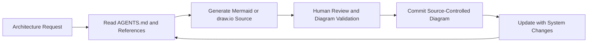
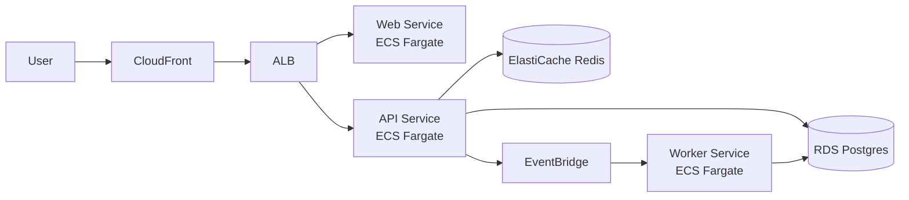

# Editable AI-Generated Architecture Diagrams

Create editable, source-controlled, maintainable software architecture diagrams from AI prompts.

This repository standardizes diagrams-as-code workflows so AI-generated diagrams stay easy to review, version, and update over time.

Supported outputs and use cases:

- Mermaid diagrams for architecture documentation, C4 diagrams, workflows, sequence diagrams, and data models
- draw.io diagrams for canvas-heavy layouts and polished architecture visuals
- AI-assisted architecture documentation that stays aligned with real systems
- source-controlled diagrams for long-term maintainability

## How This Skill Works

### Foundation: Human and Agent Consumption Flow

```mermaid
flowchart TB
	user[Developer or AI Agent User]

	subgraph agents[AI Coding Agents]
		claude[Claude Code]
		codex[Codex]
		copilot[GitHub Copilot]
		cursor[Cursor]
	end

	subgraph adapters[Compatibility Adapters]
		claudeMd[CLAUDE.md]
		copilotMd[.github/copilot-instructions.md]
		cursorRules[.cursor/rules]
		codexMd[adapters/codex.md]
	end

	agentsDoc[AGENTS.md<br/>Canonical Guidance]

	subgraph resources[Reusable Resources]
		prompts[/prompts]
		templates[/templates]
		examples[/examples]
		references[/references]
	end

	subgraph outputs[Editable Outputs]
		mermaidOut[Mermaid]
		drawioOut[draw.io]
		c4Out[C4 Architecture]
		docsOut[Architecture Documentation]
	end

	user --> claude
	user --> codex
	user --> copilot
	user --> cursor

	claude --> claudeMd
	codex --> codexMd
	copilot --> copilotMd
	cursor --> cursorRules

	claudeMd --> agentsDoc
	codexMd --> agentsDoc
	copilotMd --> agentsDoc
	cursorRules --> agentsDoc

	agentsDoc --> prompts
	agentsDoc --> templates
	agentsDoc --> examples
	agentsDoc --> references

	prompts --> mermaidOut
	templates --> mermaidOut
	templates --> drawioOut
	examples --> c4Out
	references --> docsOut

	mermaidOut --> docsOut
	drawioOut --> docsOut
	c4Out --> docsOut
```

### Prompt to Generation to Maintenance Lifecycle



### Diagrams-as-Code in Git Workflow


## Works With

This repository includes compatibility adapters for:

- Claude Code
- OpenAI Codex
- GitHub Copilot
- Cursor
- VS Code AI workflows

Included adapter surfaces:

- [CLAUDE.md](CLAUDE.md)
- [.github/copilot-instructions.md](.github/copilot-instructions.md)
- [.cursor/rules/diagrams.mdc](.cursor/rules/diagrams.mdc)
- [adapters/codex.md](adapters/codex.md)

## Skill Installation Guidance

Use this section to install this specific diagram skill (`planktonsoup-editable-software-diagrams`) for each supported agent ecosystem.

Brief evergreen install points for this skill:

- Claude Code: use Claude's native skill discovery paths. Project location: `.claude/skills/<skill-name>/SKILL.md`. User fallback: `~/.claude/skills/<skill-name>/SKILL.md`. For shared project guidance, Claude also reads `./CLAUDE.md` or `./.claude/CLAUDE.md`, with user fallback `~/.claude/CLAUDE.md`.
- GitHub Copilot: use repository custom instructions at [.github/copilot-instructions.md](.github/copilot-instructions.md). Copilot also supports agent instructions via nearest [AGENTS.md](AGENTS.md) and path-specific instructions under `.github/instructions/*.instructions.md`.
- Cursor: use project rules under `.cursor/rules/` (for example [.cursor/rules/diagrams.mdc](.cursor/rules/diagrams.mdc)). User fallback is Cursor User Rules in settings (global), not a documented filesystem path.
- Codex workflows: no stable, official local skill-folder discovery path is documented in OpenAI API docs; bind this repository as project context and use the fallback skill-spec files below.
- All agents fallback: source behavior from [AGENTS.md](AGENTS.md), [SKILL.md](SKILL.md), and [agents/openai.yaml](agents/openai.yaml) when native adapter/skill discovery is unavailable.

For best results, follow each ecosystem's official installation path and bind this repository as the skill source.

- Claude Code install path for this skill: <https://code.claude.com/docs/en/skills> and <https://code.claude.com/docs/en/memory>
- GitHub Copilot install path for this skill: <https://docs.github.com/en/copilot/customizing-copilot/adding-repository-custom-instructions-for-github-copilot>
- Cursor install path for this skill: <https://cursor.com/docs/rules>
- Codex/OpenAI install path for this skill: <https://platform.openai.com/docs>
- VS Code AI workflow baseline: <https://code.visualstudio.com/docs/copilot/overview>

Recommended installation order for this skill:

1. Use the agent-specific installation path from the official docs above.
2. Bind this repository as the skill source in that ecosystem.
3. Validate the skill by running a simple architecture-diagram prompt.

Fallback installation path for this skill (agent skills spec):

If a tool does not support a dedicated adapter format, use this repository's skill spec files directly:

- [AGENTS.md](AGENTS.md) as canonical operational guidance
- [SKILL.md](SKILL.md) as the behavior contract
- [agents/openai.yaml](agents/openai.yaml) as runtime metadata where supported

This fallback path ensures consistent inclusion even when an agent lacks first-class adapter support.

## Prompt to Output Example

### Example Prompt

"Generate a Mermaid C4-style container diagram for an AWS SaaS platform with CloudFront, ALB, ECS Fargate services, RDS, Redis, and EventBridge. Keep labels concise and editable."

### Generated Mermaid Output



Rendered result is directly viewable in GitHub Markdown with Mermaid support, and the source remains fully editable.

## Why This Exists

AI-generated diagrams are often hard to maintain because they are image-only, inconsistent, or disconnected from source control.

This repository solves that by providing reusable conventions for:

- editable diagrams instead of raster-only output
- maintainable architecture documentation workflows
- Mermaid and draw.io standards for AI-generated diagrams
- source-friendly artifacts that are easy to diff and review

## Quick Start

### Claude Code

Use this repository as diagram conventions context. Read [AGENTS.md](AGENTS.md) and [SKILL.md](SKILL.md), then generate or edit Mermaid or draw.io architecture diagrams.

Expected output: editable diagram source plus concise architecture documentation.

### Cursor

Use [.cursor/rules/diagrams.mdc](.cursor/rules/diagrams.mdc) as the compatibility entrypoint, then apply canonical guidance from [AGENTS.md](AGENTS.md).

Expected output: maintainable Mermaid or draw.io files that remain source-control friendly.

### GitHub Copilot Chat

Reference [.github/copilot-instructions.md](.github/copilot-instructions.md), then follow [AGENTS.md](AGENTS.md) and [SKILL.md](SKILL.md) to produce editable architecture diagrams.

Expected output: diagrams-as-code artifacts suitable for PR review and iteration.

### Codex Workflows

Start with [adapters/codex.md](adapters/codex.md), then use [AGENTS.md](AGENTS.md), [references/mermaid.md](references/mermaid.md), and [references/drawio.md](references/drawio.md).

Expected output: architecture-focused Mermaid or draw.io sources optimized for long-term maintenance.

## For Agent Tools

Canonical operational guidance is in [AGENTS.md](AGENTS.md).

Adapter files are intentionally lightweight compatibility entrypoints so guidance stays consistent across agent ecosystems.

## Repository Structure

- [examples](examples): invocation examples and reusable demonstration assets
- [templates](templates): starter templates for architecture documentation workflows
- [prompts](prompts): reusable prompt starters for AI-generated diagrams
- [references](references): Mermaid, draw.io, and styling guidance
- [adapters](adapters): agent-specific compatibility entrypoints
- [assets](assets): base diagram templates, including Mermaid and draw.io starters

## Reuse These Resources

- Invocation examples: [examples/invocations](examples/invocations)
- Mermaid doc starter: [assets/mermaid-doc-template.md](assets/mermaid-doc-template.md)
- draw.io starter canvas: [assets/blank.drawio](assets/blank.drawio)
- Prompt scaffolding: [prompts](prompts)
- Template scaffolding: [templates](templates)

## Suggested GitHub Topics

Use these repository topics to improve discovery:

- ai
- agents
- mermaid
- drawio
- diagrams-as-code
- software-architecture
- architecture-diagrams
- c4-model
- claude-code
- github-copilot
- codex
- cursor-ai

Keywords naturally covered in this repository include Mermaid, draw.io, diagrams-as-code, software architecture, C4 diagrams, editable diagrams, AI-generated diagrams, architecture documentation, and source-controlled diagrams.
