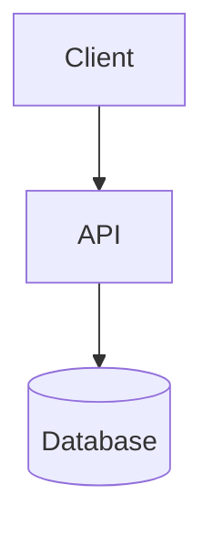

# [Diagram Title]

Briefly explain what this diagram shows, which subsystem or workflow it covers, and what level of abstraction it uses.

## Diagram

## Notes

- Keep terminology aligned with the codebase.
- Call out notable boundaries, assumptions, or optional flows here.
- Link to related diagrams or design notes when useful.
