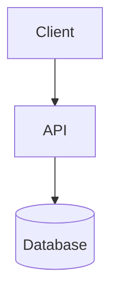

# [Diagram Title]

Briefly explain what this diagram shows, which subsystem or workflow it covers, and what level of abstraction it uses.

## Diagram

## Notes

- Keep terminology aligned with the codebase.
- Use a standard software engineering diagram type unless the request explicitly asks for another notation.
- Use explicit flowchart node IDs with bracketed labels, such as `api[API]`; do not use quoted implicit node IDs like `"API Service"`.
- Keep Mermaid labels parser-safe. Prefer plain phrases over embedded quoted code examples.
- Do not use literal `\n` in Mermaid labels; use ` ` for visual line breaks when supported.
- For architecture overviews that must render in GitHub, use `flowchart` and avoid `architecture-beta`.
- Avoid renderer-sensitive Mermaid features unless required: `%%{init: ...}%%`, edge IDs, and animation syntax.
- Call out notable boundaries, assumptions, or optional flows here.
- Link to related diagrams or design notes when useful.
