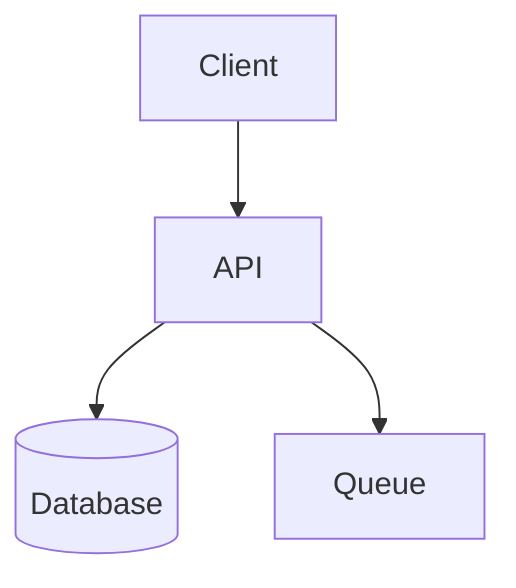
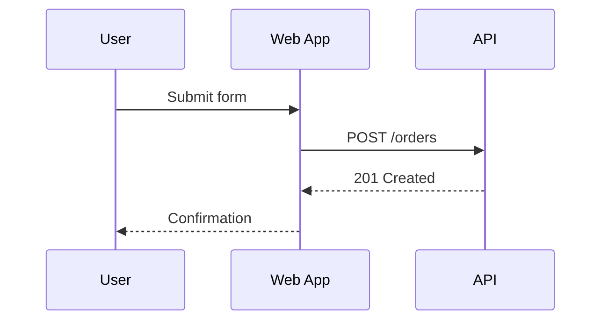
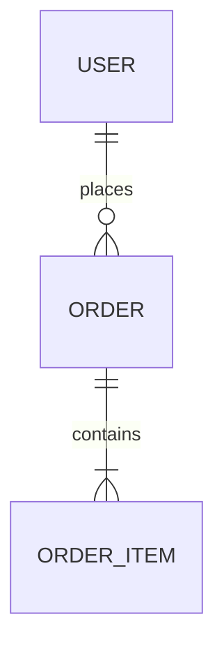
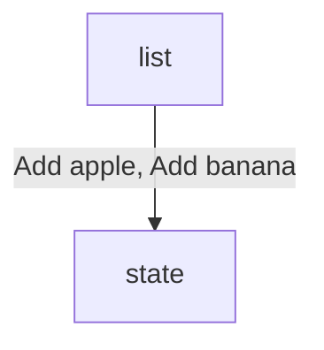

# Mermaid Reference

Use Mermaid when a software-development diagram can be expressed as structured text without precise manual positioning.

## Good Fits

- `flowchart` for workflows, request paths, branching logic, service maps, and architecture overviews
- `sequenceDiagram` for interactions over time between users, apps, services, workers, and providers
- `stateDiagram-v2` for lifecycle transitions in entities, jobs, or runtime components
- `classDiagram` for type or module relationships when those relationships matter to the design
- `erDiagram` for data models and storage relationships
- `journey`, `timeline`, `gantt`, `pie`, `gitGraph`, `mindmap` when the request clearly matches those views

## Choose Diagram Type Fast

- Use `flowchart` for process or architecture overviews.
- Use `sequenceDiagram` when order and message timing matter.
- Use `stateDiagram-v2` for status transitions and lifecycle rules.
- Use `erDiagram` for tables, entities, and cardinality.
- Use `classDiagram` only when type relationships are the point of the diagram.
- Prefer `flowchart` over `classDiagram` for service architecture unless code structure is the real subject.

## Practical Patterns

### Flowchart



### Sequence Diagram



### ER Diagram



## Editing Rules

- Keep one diagram per fenced block or file unless the user explicitly wants multiple.
- Prefer simple labels over inline paragraphs.
- Use subgraphs only when they materially clarify grouping.
- Do not over-style with classes unless the styling carries meaning.
- If Markdown already contains surrounding headings and prose, edit only the relevant fenced block.
- Save Mermaid source and Markdown files that host Mermaid as UTF-8 without BOM.
- Preserve existing node IDs when editing an existing Mermaid diagram unless they are actively harmful.
- Verify that every referenced node ID is declared exactly once in the diagram and that edges render to the intended node after any rename or refactor.
- Avoid unsupported syntax guesses; choose a simpler Mermaid construct when uncertain.
- Ensure all Mermaid text contrasts with the rendered surface behind it, including node labels, section labels, notes, and connector labels.
- Do not accept Mermaid theme or class styling that makes text blend into the page, node fill, or local label surface.
- Treat label text as part of syntax validation, not just content. Edge labels and node labels should use plain language rather than code-like text with embedded double quotes, escaped quotes, or dense punctuation.
- Do not treat `\n` as a portable Mermaid line-break mechanism. If a label needs multiple visual lines, use Mermaid-supported line-break syntax for that diagram family, such as `<br/>` where supported, or shorten and split the wording.
- Keep Mermaid connector labels visually plain and background-transparent. Do not emulate Draw.io label backfills, filled label plates, or semi-opaque label boxes for Mermaid edge labels.
- When `mmdc` is installed locally, use it as the default validation path and require a successful render from the final Mermaid source before considering the edit complete.
- Preview the rendered diagram when possible and treat visually detached or ambiguous edges as correctness bugs.
- When a long edge renders as if it misses its target, shorten the route by re-laying out nodes, adding an intermediate anchor node, or splitting the diagram.
- Prefer nearby concrete nodes or dedicated anchor nodes over distant container-like targets when Mermaid layout makes the endpoint relationship hard to read.

## Local CLI Validation

- Check for `mmdc` first.
- Probe cross-platform in this order: `PATH`, then common package-manager shim directories, then common app install locations for the current OS.
- On Windows, common fallback locations include `%AppData%\\npm`, Scoop shims, Chocolatey `bin`, and explicit app install folders.
- On macOS, common fallback locations include `/opt/homebrew/bin`, `/usr/local/bin`, `~/Applications`, and `/Applications`.
- On Linux, common fallback locations include `~/.local/bin`, `/usr/local/bin`, `/usr/bin`, `/snap/bin`, and AppImage-style install paths.
- If the diagram is already a standalone `.mmd`, render that file directly.
- If Mermaid is embedded in Markdown, extract the final fenced block to a temporary `.mmd` file and render that temporary file so the validation matches the exact checked-in source.
- If `mmdc` is not installed, fall back to a Mermaid-compatible preview or to manual structural validation, and note that CLI render validation was unavailable. Do not skip validation.

## Label Safety

- Prefer labels like `Add apple`, `Cache hit`, or `POST /orders` over labels that try to embed source-code examples.
- If you need to show exact code or string literals such as `Add("apple")`, put them in the surrounding Markdown instead of inside the Mermaid label.
- If you need a visual line break inside a Mermaid label, prefer `<br/>` when the chosen Mermaid diagram family supports it. If not, rewrite the label into a shorter single-line phrase and move detail into surrounding prose.
- Avoid escaped quotes such as `\"apple\"` inside Mermaid labels. Some renderers reject them even when the surrounding diagram structure is otherwise valid.
- Avoid literal `\n` in Mermaid labels unless the target Mermaid syntax for that exact construct explicitly interprets it as a line break and the rendered preview confirms it.
- When a parser error points near a label, simplify the label first, then re-check the diagram before making broader changes.

### Safer Example

Instead of:

```mermaid
flowchart TD
    list -->|"Add(\"apple\"), Add(\"banana\")"| state
```

Prefer:



Then describe the exact method calls in the prose around the diagram if that precision still matters.

## Hosting In Markdown

Prefer hosting Mermaid in Markdown when developers are likely to read the diagram alongside technical explanation.

- Put a short heading immediately above the Mermaid block.
- Add one or two sentences of scope or interpretation above or below the block.
- Keep the block self-contained so it still makes sense when previewed alone.
- When a standalone `.mmd` file is used, link it from the nearest `README.md` or design note if discoverability matters.
