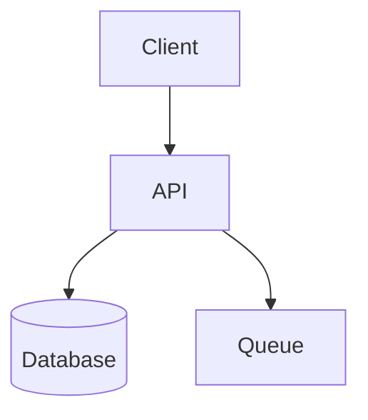
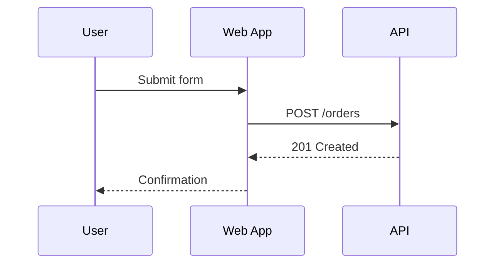
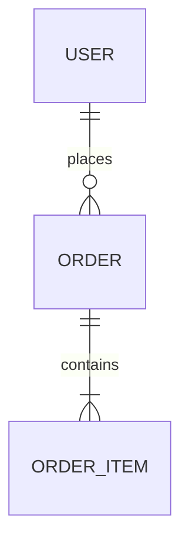
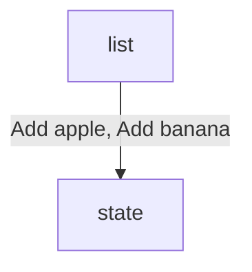

# Mermaid Reference

Use when diagram expressible as structured text without manual positioning.

## Good Fits

- `flowchart` — workflows, req paths, branching logic, service maps, arch overviews
- `sequenceDiagram` — interactions over time: users, apps, services, workers, providers
- `stateDiagram-v2` — lifecycle transitions: entities, jobs, runtime components
- `classDiagram` — type/module relationships when those matter to design
- `erDiagram` — data models, storage relationships
- `journey`, `timeline`, `gantt`, `pie`, `gitGraph`, `mindmap` — when req clearly matches

## Choose Diagram Type Fast

- `flowchart` — process/arch overviews.
- `sequenceDiagram` — order + message timing matter.
- `stateDiagram-v2` — status transitions, lifecycle rules.
- `erDiagram` — tables, entities, cardinality.
- `classDiagram` — type relationships are the point.
- Prefer `flowchart` over `classDiagram` for service arch unless code structure is real subject.

## Practical Patterns

### Flowchart



### Sequence Diagram



### ER Diagram



## Editing Rules

- One diagram per fenced block/file unless user wants multiple.
- Simple labels over inline paragraphs.
- Subgraphs only when they materially clarify grouping.
- No over-styling with classes unless styling carries meaning.
- MD with surrounding headings/prose → edit only relevant fenced block.
- Save Mermaid source + hosting MD as UTF-8 no BOM.
- Preserve existing node IDs unless actively harmful.
- Verify every referenced node ID declared exactly once; edges render to intended node after rename/refactor.
- Unsupported syntax → pick simpler construct.
- All Mermaid text contrasts with rendered surface: node labels, section labels, notes, connector labels.
- No theme/class styling that blends text into page, node fill, or label surface.
- Label text = part of syntax validation. Plain language. No embedded double quotes, escaped quotes, dense punctuation.
- No `\n` as portable line-break. `<br/>` where supported; else shorten/split wording.
- Connector labels: visually plain, bg-transparent. No draw.io-style backfills, filled label plates, semi-opaque boxes.
- `mmdc` installed → default validation path. Require successful render before edit complete.
- Preview when possible. Visually detached/ambiguous edges = correctness bugs.
- Long edge misses target → re-layout nodes, add intermediate anchor node, or split diagram.
- Prefer nearby concrete/anchor nodes over distant container-like targets.

## Local CLI Validation

- Check `mmdc` first.
- Probe cross-platform: `PATH` → pkg-manager shims → OS app install locations.
- Windows fallbacks: `%AppData%\\npm`, Scoop shims, Chocolatey `bin`, explicit install folders.
- macOS fallbacks: `/opt/homebrew/bin`, `/usr/local/bin`, `~/Applications`, `/Applications`.
- Linux fallbacks: `~/.local/bin`, `/usr/local/bin`, `/usr/bin`, `/snap/bin`, AppImage paths.
- Standalone `.mmd` → render directly.
- Mermaid in MD → extract fenced block to temp `.mmd`, render that.
- `mmdc` not installed → fallback to Mermaid-compatible preview or manual structural validation; note CLI unavailable. No skip validation.

## Label Safety

- Prefer `Add apple`, `Cache hit`, `POST /orders` over embedded source-code examples.
- Exact code/string literals like `Add("apple")` → put in surrounding MD, not inside label.
- Need visual line break → `<br/>` if family supports; else shorten to single-line phrase, move detail to prose.
- No escaped quotes (`\"apple\"`) in labels. Some renderers reject even when structure valid.
- No literal `\n` in labels unless syntax explicitly interprets it + preview confirms.
- Parser error near label → simplify label first, re-check before broader changes.

### Safer Example

Instead of:

```mermaid
flowchart TD
    list -->|"Add(\"apple\"), Add(\"banana\")"| state
```

Prefer:



Describe exact method calls in prose if precision matters.

## Hosting In Markdown

Host in MD when devs read diagram alongside technical explanation.

- Short heading immediately above block.
- 1–2 sentences of scope/interpretation above or below.
- Block self-contained — readable when previewed alone.
- Standalone `.mmd` → link from nearest `README.md` or design note if discoverability matters.
