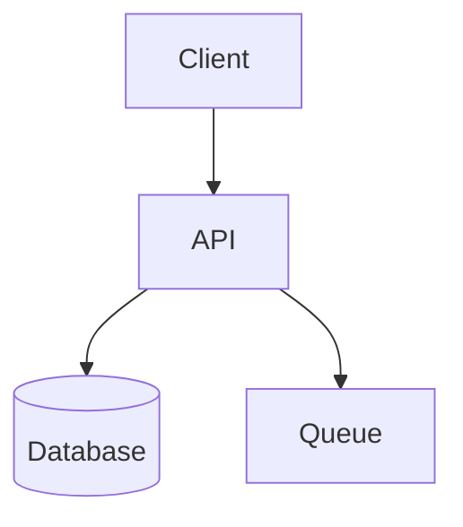
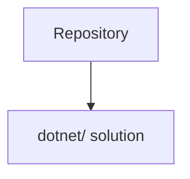
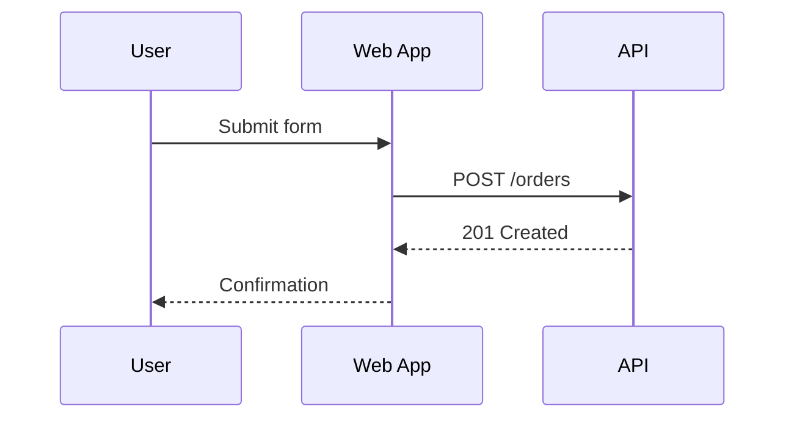
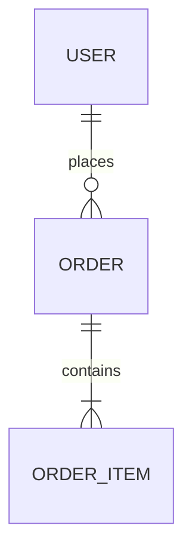
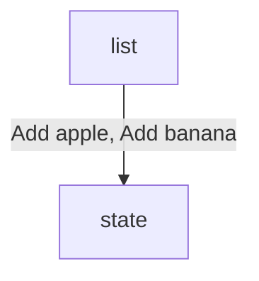

# Mermaid Reference

Use Mermaid when a software-development diagram can be expressed as structured text without precise manual positioning.

## Good Fits

- `flowchart` for workflows, request paths, branching logic, service maps, and architecture overviews
- `sequenceDiagram` for interactions over time between users, apps, services, workers, and providers
- `stateDiagram-v2` for lifecycle transitions in entities, jobs, or runtime components
- `classDiagram` for type or module relationships when those relationships matter to the design
- `erDiagram` for data models and storage relationships
- `journey`, `timeline`, `gantt`, `pie`, `gitGraph`, `mindmap` only when the request clearly matches those views or the user asks for them

## Choose Diagram Type Fast

- Start with well-known software engineering diagram types. Use novelty or specialized Mermaid families only when they are the clearest standard fit for the user's request.
- Use `flowchart` for process or architecture overviews.
- Use `sequenceDiagram` when order and message timing matter.
- Use `stateDiagram-v2` for status transitions and lifecycle rules.
- Use `erDiagram` for tables, entities, and cardinality.
- Use `classDiagram` only when type relationships are the point of the diagram.
- Prefer `flowchart` over `classDiagram` for service architecture unless code structure is the real subject.
- If the user names a specific diagram type, honor that type when it stays within Mermaid or the user's explicit scope override.

## Renderer Compatibility (GitHub-First)

- Default to syntax that renders reliably across Mermaid runtimes, with GitHub as the baseline target.
- For architecture diagrams, use `flowchart` and avoid `architecture-beta` by default.
- Avoid diagram families with uneven renderer support unless explicitly requested and called out: `architecture-beta`, `c4`, `packet`, `block`, `sankey`, `xyChart`, `quadrantChart`, `requirement`.
- Avoid renderer-sensitive features unless required: `%%{init: ...}%%` directives, edge IDs, edge animation, and custom icon-pack dependencies.
- Use simple node/edge syntax and plain labels over advanced styling shortcuts when compatibility is the priority.

Known compatibility fix:

- If a diagram uses `architecture-beta` and must render in GitHub, rewrite it as a `flowchart` while preserving component names and relationship direction.

## Practical Patterns

### Flowchart



Declare flowchart nodes with stable explicit IDs and separate labels. This keeps diagrams portable across Mermaid renderers and prevents labels with spaces, slashes, or punctuation from becoming fragile node identifiers.

Instead of:

```text
flowchart TD
    "Repository" --> "dotnet/ solution"
```

Prefer:



### Sequence Diagram



### ER Diagram



## Editing Rules

- Keep one diagram per fenced block or file unless the user explicitly wants multiple.
- Prefer simple labels over inline paragraphs.
- Use subgraphs only when they materially clarify grouping.
- Do not over-style with classes unless the styling carries meaning.
- If Markdown already contains surrounding headings and prose, edit only the relevant fenced block.
- Save Mermaid source and Markdown files that host Mermaid as UTF-8 without BOM.
- Preserve existing node IDs when editing an existing Mermaid diagram unless they are actively harmful.
- Use explicit node IDs with bracketed labels in flowcharts; do not use quoted text as an implicit node ID.
- Keep node IDs short, stable, and syntax-safe. Put spaces, slashes, punctuation, and display wording in the label, not the ID.
- Treat Mermaid parser or lexer errors as blocking failures. Resolve them before considering the diagram complete.
- Verify that every referenced node ID is declared exactly once in the diagram and that edges render to the intended node after any rename or refactor.
- Avoid unsupported syntax guesses; choose a simpler Mermaid construct when uncertain.
- Ensure all Mermaid text contrasts with the rendered surface behind it, including node labels, section labels, notes, and connector labels.
- Do not accept Mermaid theme or class styling that makes text blend into the page, node fill, or local label surface.
- Treat label text as part of syntax validation, not just content. Edge labels and node labels should use plain language rather than code-like text with embedded double quotes, escaped quotes, or dense punctuation.
- Use actual newline characters to separate Mermaid statements; do not serialize line breaks as the literal two-character sequence `\n`.
- Do not treat `\n` as a portable Mermaid line-break mechanism. If a label needs multiple visual lines, use Mermaid-supported line-break syntax for that diagram family, such as `<br/>` where supported, or shorten and split the wording.
- Keep Mermaid connector labels visually plain and background-transparent. Do not emulate Draw.io label backfills, filled label plates, or semi-opaque label boxes for Mermaid edge labels.
- Treat GitHub rendering compatibility as a correctness requirement unless the user explicitly targets a different Mermaid runtime.
- When `mmdc` is installed locally, use it as the default validation path and require a successful render from the final Mermaid source before considering the edit complete.
- Preview the rendered diagram when possible and treat visually detached or ambiguous edges as correctness bugs.
- When a long edge renders as if it misses its target, shorten the route by re-laying out nodes, adding an intermediate anchor node, or splitting the diagram.
- Prefer nearby concrete nodes or dedicated anchor nodes over distant container-like targets when Mermaid layout makes the endpoint relationship hard to read.

## Local CLI Validation

- Check for `mmdc` first.
- Probe cross-platform in this order: `PATH`, then common package-manager shim directories, then common app install locations for the current OS.
- On Windows, common fallback locations include `%AppData%\\npm`, Scoop shims, Chocolatey `bin`, and explicit app install folders.
- On macOS, common fallback locations include `/opt/homebrew/bin`, `/usr/local/bin`, `~/Applications`, and `/Applications`.
- On Linux, common fallback locations include `~/.local/bin`, `/usr/local/bin`, `/usr/bin`, `/snap/bin`, and AppImage-style install paths.
- If the diagram is already a standalone `.mmd`, render that file directly.
- If Mermaid is embedded in Markdown, extract the final fenced block to a temporary `.mmd` file and render that temporary file so the validation matches the exact checked-in source.
- If multiple Mermaid fenced blocks were edited, validate each edited block.
- If `mmdc` is not installed, fall back to a Mermaid-compatible preview or to manual structural validation, and note that CLI render validation was unavailable. Do not skip validation.
- During manual structural validation, scan flowcharts for quoted implicit node IDs such as `"Repository" --> "dotnet/ solution"` and rewrite them as explicit IDs with bracketed labels before completion.

## Label Safety

- Prefer labels like `Add apple`, `Cache hit`, or `POST /orders` over labels that try to embed source-code examples.
- If you need to show exact code or string literals such as `Add("apple")`, put them in the surrounding Markdown instead of inside the Mermaid label.
- If you need a visual line break inside a Mermaid label, prefer `<br/>` when the chosen Mermaid diagram family supports it. If not, rewrite the label into a shorter single-line phrase and move detail into surrounding prose.
- Avoid escaped quotes such as `\"apple\"` inside Mermaid labels. Some renderers reject them even when the surrounding diagram structure is otherwise valid.
- Treat literal `\n` in Mermaid labels as invalid by default and rewrite before completion.
- Preferred fix for label text like `Load existing DonationIntent\nand return current result`: replace `\n` with `<br/>` when supported, otherwise shorten to a single line and move detail to nearby prose.
- During final validation, scan Mermaid labels for literal `\n` tokens and treat them as errors.
- When a parser error points near a label, simplify the label first, then re-check the diagram before making broader changes.

### Safer Example

Instead of:

```mermaid
flowchart TD
    list -->|"Add(\"apple\"), Add(\"banana\")"| state
```

Prefer:



Then describe the exact method calls in the prose around the diagram if that precision still matters.

## Hosting In Markdown

Prefer hosting Mermaid in Markdown when developers are likely to read the diagram alongside technical explanation.

- Put a short heading immediately above the Mermaid block.
- Add one or two sentences of scope or interpretation above or below the block.
- Keep the block self-contained so it still makes sense when previewed alone.
- When a standalone `.mmd` file is used, link it from the nearest `README.md` or design note if discoverability matters.
