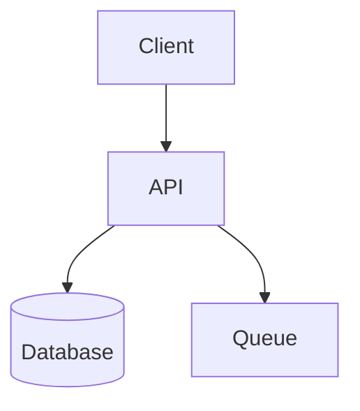
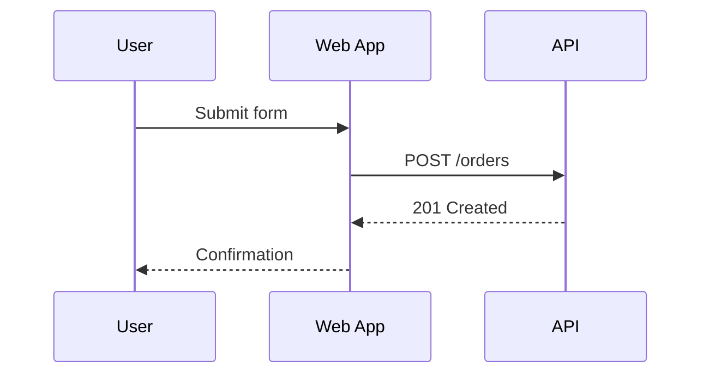
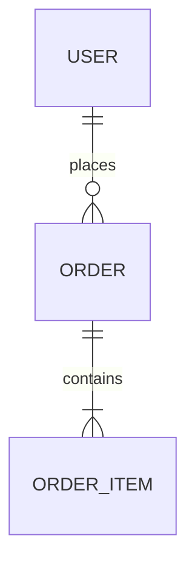

# Mermaid Reference

Use Mermaid when a software-development diagram can be expressed as structured text without precise manual positioning.

## Good Fits

- `flowchart` for workflows, request paths, branching logic, service maps, and architecture overviews
- `sequenceDiagram` for interactions over time between users, apps, services, workers, and providers
- `stateDiagram-v2` for lifecycle transitions in entities, jobs, or runtime components
- `classDiagram` for type or module relationships when those relationships matter to the design
- `erDiagram` for data models and storage relationships
- `journey`, `timeline`, `gantt`, `pie`, `gitGraph`, `mindmap` when the request clearly matches those views

## Choose Diagram Type Fast

- Use `flowchart` for process or architecture overviews.
- Use `sequenceDiagram` when order and message timing matter.
- Use `stateDiagram-v2` for status transitions and lifecycle rules.
- Use `erDiagram` for tables, entities, and cardinality.
- Use `classDiagram` only when type relationships are the point of the diagram.
- Prefer `flowchart` over `classDiagram` for service architecture unless code structure is the real subject.

## Practical Patterns

### Flowchart

### Sequence Diagram

### ER Diagram

## Editing Rules

- Keep one diagram per fenced block or file unless the user explicitly wants multiple.
- Prefer simple labels over inline paragraphs.
- Use subgraphs only when they materially clarify grouping.
- Do not over-style with classes unless the styling carries meaning.
- If Markdown already contains surrounding headings and prose, edit only the relevant fenced block.
- Preserve existing node IDs when editing an existing Mermaid diagram unless they are actively harmful.
- Avoid unsupported syntax guesses; choose a simpler Mermaid construct when uncertain.
